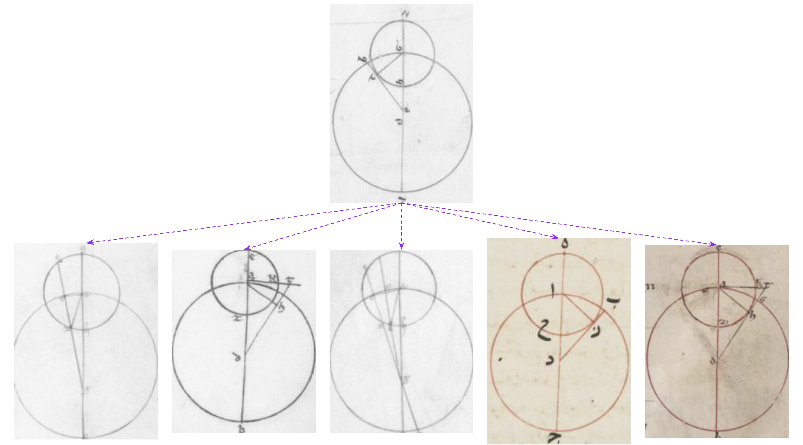

# Diagrams extraction and deep feature generation

This repository presents a method to automatically detect astronomical diagrams in manuscripts, based on the work [docExtractor](https://github.com/monniert/docExtractor) (by Tom Monnier), and a way to explore these diagrams thanks to deep features, based on the work [ImageCollation](https://github.com/Rykoua/ImageCollation) (by Ryad Kaoua and Xi Shen).

**Nota bene**: In this repository, we use [tableTranscriber](https://github.com/tristandot/tableTranscriber) for elements extraction: a modified version of docExtractor composed of 4 final branches to perform multi label classification and table structure recognition (please see our corresponding [work report](https://github.com/tristandot/tableTranscriber/blob/master/work_report_tableTranscriber.pdf) for more details). To detect astronomical diagrams, without caring about tables analysis, [docExtractor](https://github.com/monniert/docExtractor) could be used as it is, since no multi label classification is necessary for this task. In consequence, feel free to clone [docExtractor](https://github.com/monniert/docExtractor) and use it instead of tableTranscriber for diagrams detection – it is certainly simpler, when you don't want to work on tables at the same time than diagrams.

If you decide to work with docExtractor, you can simply re-use the synthetic `DiagramElement` class defined in `tableTranscriber/tableExtractor/src/synthetic/element.py`, and modify the `docExtractor/src/utils/constant.py` and `docExtractor/src/synthetic/document.py` files in consequences (to create a new label corresponding to diagrams, and to generate synthetic documents with such diagrams).




### Prerequisites

You must have Anaconda installed on your computer.

### 1. Create conda environment

```
conda env create -f environment.yml
conda activate tableTranscriber
```

### 2. Download resources and models

To download our models and datasets, please enter the following command:

```bash
./download.sh
```

It will download: 
- our trained model for diagrams detection (located: `tableTranscriber/tableExtractor/models/four_branches_diagrams`)
- docExtractor's default trained model (created by Tom Monnier, located: `tableTranscriber/tableExtractor/models/default`)
- synthetic resources needed to generate SynDoc (collected by Tom Monnier, located: `tableTranscriber/tableExtractor/synthetic_resource`)
- a synthetic dataset with 10K images and their corresponding ground truths for the 4 branches of our tableTranscriber network (located: `tableTranscriber/tableExtractor/datasets/synthetic_diagrams`) ; the synthetic images contain tables and diagrams inspired by astronomical manuscripts
- an annotated diagrams dataset, `Diagrams_Dataset` (located: `tableTranscriber/tableExtractor/datasets/Diagrams_Dataset`, composed of ~200 annotated arabic and latin manuscripts images with diagrams, and indications concerning byzantine diagrams ; `Diagrams_Dataset` can be used to fine-tune, or evaluate, some existing diagrams detection networks)
- a cropped diagrams dataset (with a lot of noise), `Cropped_Diagrams` (composed of ~5K diagrams from the Almagest, the Sacrobosco and the Theorica Planteraum works, -not very well- cropped by our model `four_branches_diagrams`) ; it can be used to explore deep visual similarity properties, through the `diagrams_retrieval.ipynb` notebook


## Generation of new synthetic diagrams
To generate new synthetic manuscripts images, please use the following command:

```bash
python tableTranscriber/tableExtractor/src/syndoc_generator.py -d dataset_name -n nb_train --merged_labels --table_multi_labels
```
Main arguments:
- `-d, --dataset_name`: name of the folder containing the synthetic dataset
- `-n, --nb_train`: number of training samples to generate
- `-m, --merged_labels`: whether to merge all graphical and textual labels into unique `illustration` and `text` labels (the `diagram` elements will be part of the `illustration` label in this case) 
- `-t, --table_multi_labels`: whether or not to generate 4 distinct datasets, to deal with multi label classification (in order to train a network with 4 branches, necessary for the recognition of tables structures) ; **N.B.**: this parameter does not exist if you work with docExtractor

The training datasets have the following structure:
- they are composed of three distinct `train`, `val` and `test` folders
- in these folders, each `name.jpg` input image is linked to a corresponding `name_seg.png` ground truth label image

The synthetic dataset layouts, and element compositions can be easily changed by modifying:
- the variables defined in `tableTranscriber/tableExtractor/src/synthetic/document.py` (and especially the variables `LAYOUT_RANGE` and `ELEMENT_FREQ`)
- the classes defined in `tableTranscriber/tableExtractor/src/synthetic/element.py` (especially the class `DiagramElement`)

**N.B.**: All the labels, and corresponding colors are defined in `tableTranscriber/tableExtractor/src/utils/constant.py`. 

## Training

### Segmentation training:
In order to train a new segmentation neural network, please use the following command:

```bash
CUDA_VISIBLE_DEVICES=gpu_id python tableTranscriber/tableExtractor/src/trainer.py --config file --tag tag
```

Main arguments:
- `-c, --config`: name of the training configuration file (e.g. `syndoc_4_branches.yml`)
- `-t, --tag`: name given to the newly trained neural network

The important file is the config file in `.yml`, which especially gives the localization for the ground truth dataset for each branch of the network. Moreover, the data augmentation, models and learning parameters are defined in this config file.

In this config file are also defined the restricted labels on which are trained each one of the branches of the neural network (labels defined in `tableTranscriber/tableExtractor/src/utils/constant.py`).

The important label, for diagram analysis, is:
- `DIAGRAM_LABEL` = 12

This `DIAGRAM_LABEL` is part of the `ILLUSTRATION_LABEL` if the `--merged_labels` parameter is set on `True` during the synthetic dataset generation.

### Fine-tune network on custom segmentation datasets

Concerning fine-tuning, please see the corresponding [docExtractor](https://github.com/monniert/docExtractor) `README` explanations, especially concerning the use of [VGG Image Anotator](http://www.robots.ox.ac.uk/~vgg/software/via/) and `tableTranscriber/tableExtractor/src/via_converter.py` tool to create the corresponding annotated images training dataset. 

To fine tune a neural network, the `pretrained` variable of the training `.yml` config file must correspond to a pre-trained network `.pkl` (for instance `default`, or `four_branches_diagrams`).

The `Diagrams_Dataset` (composed of ~200 annotated arabic and latin manuscripts with diagrams) contains a `diagrams_annotations.json` file that can be easily modified and increased thanks to VIA, and used with `via_converter.py` to generate new real-world annotations. 

In the `Diagrams_Dataset` folder, a file concerning byzantine manuscripts with diagrams can also be found under the name `dataset_byzantine_manuscripts_containing_astronomical_diagrams_dmanolova.csv`. Using the informations in this file, byzantine diagrams could be added to the `Diagrams_Dataset` dataset, and easily annotated thanks to VIA and `via_converter.py`, in order to perform new fine-tuning trainings or real-world evaluations of the diagrams detection methods.

## Diagrams extraction

In order to perform diagrams extraction, please use the following command:

```bash
CUDA_VISIBLE_DEVICES=gpu_id python tableTranscriber/tableExtractor/src/extractor.py --input_dir inp --output_dir out --tag tag --labels labels_id
```

Its main arguments are:
- `-i, --input_dir`: path of the directory of the images to process
- `-o, --output_dir`: pass of the directory where the extracted images will be saved 
- `-t, --tag`: name of the segmentation model
- `-l, --labels`: elements labels to extract (the default labels correspond to illustration and text labels)
- `-s, --save_annot`: whether to save annotated images while extracting
- `-sb, --straight_bbox`: whether to use straight bounding boxes instead of rotated ones to fit connected components

An example of a diagram extraction command is (when diagrams are part of the illustration class):

```bash
CUDA_VISIBLE_DEVICES=0 python tableTranscriber/tableExtractor/src/extractor.py --input_dir Theorica_Planteraum --tag four_branches_diagrams --output_dir results/Theorica_Planteraum --labels 1 --save_annot --straight_bbox --verbose
```

**N.B.**: please check `tableTranscriber/tableExtractor/src/utils/constant.py` for labels mapping

## Deep features analysis

Once you have extracted some diagrams, you can start playing with the possibilities of deep visual similarities, by following the notebook `diagrams_retrieval.ipynb`: the *conv4* features of a ResNet-50 (pre-trained on ImageNet) are used in order to compute cosine similarities between cropped images of diagrams (from the ~5K cropped images of our `Cropped_Diagrams` dataset), and to perform image retrieval, clustering (after a dimensionality reduction thanks to a PCA), or data analysis (after projection in two dimensions thanks to a UMAP). These are prospective explorations of the use of deep visual similarities to help creating relevant visual links (useful for researchers) between astronomical diagrams.


